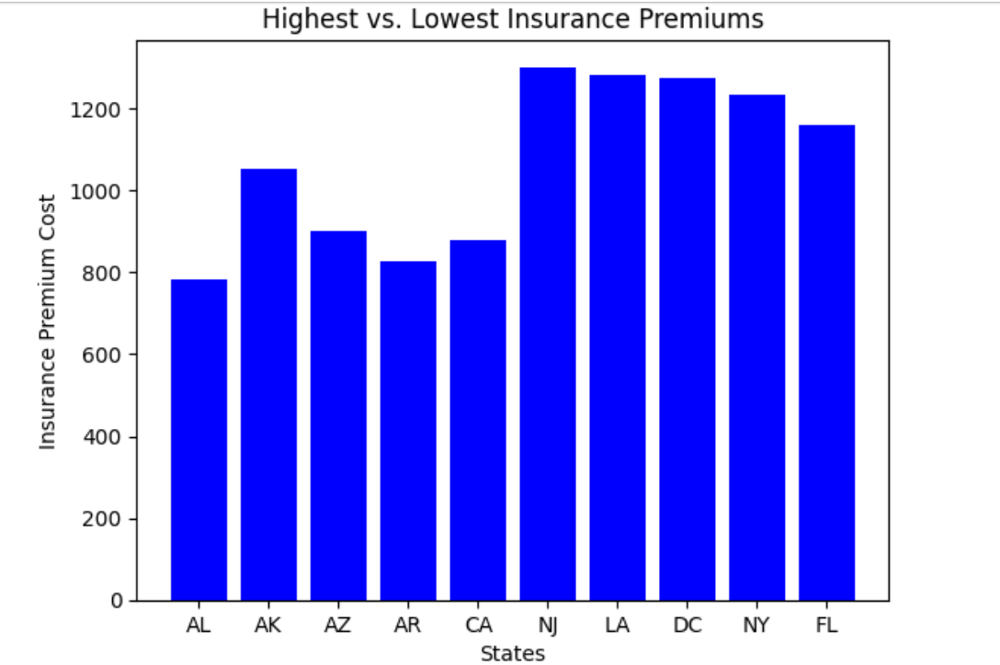

# Bad Driving is Expesnive
## Introduction
Have you ever wondered if there is a correlation between the cost of your car insurance premium and the amount of fatal car accidents that happen in your state? Well, there is. States with less occurences of fatal crashes have less costly insurance premiums. Therefore, it is important to drive cautiously and avoid car accidents to ensure the safety of others on the road and to make car insurance preiums more affordable.
## Cost of Car Insurance Premiums

The graph displays the 5 states with the cheapest car insurance premiums and the 5 states with the most expensive premiums. There is a stark contrast between the premium costs of the lowest and highest states. NJ, LA, DC, and NY all exceed $1200 while AK is the only state on the lower side that exceeds $1000. Geographically, the states with the highest costs happen to be on the east side of the country except for Louisiana. None of the states with the lowest costs appear on the east coast. These eastern states likely have the most expensive premiums in the country because they have the most reckless drivers which results in high incidents of fatal crashes. Additionally, the states with the cheapeast premiums likely have the least incidents of fatal crashes.
## Speeding Collisions

c