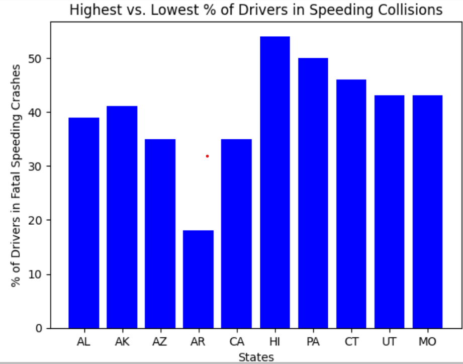
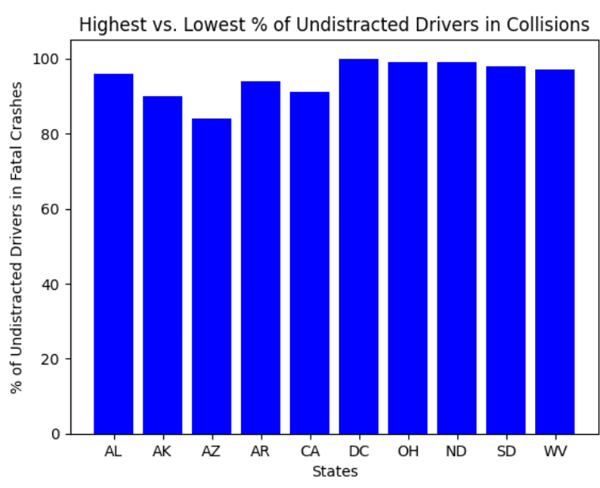
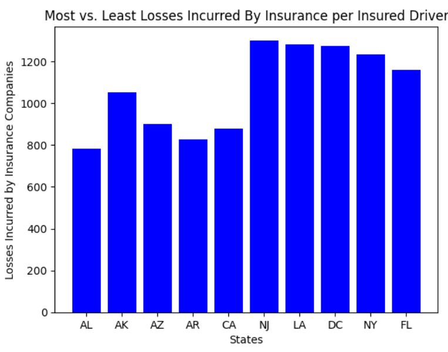

# Safe Driving Saves Money
## Introduction
Have you ever wondered if there is a correlation between the cost of your car insurance premium and the amount of fatal car accidents that happen in your state? Well, there is. States with less occurences of fatal crashes have less costly insurance premiums. Therefore, it is important to drive cautiously and avoid car accidents to ensure the safety of others on the road and to make car insurance preiums more affordable.
## Cost of Car Insurance Premiums

The graph displays the 5 states with the cheapest car insurance premiums and the 5 states with the most expensive premiums. There is a stark contrast between the premium costs of the lowest and highest states. NJ, LA, DC, and NY all exceed $1200 while AK is the only state on the lowest 5 that exceeds $1000. Geographically, the states with the highest costs happen to be on the east side of the country except for Louisiana. None of the states with the lowest costs appear on the east coast. These eastern states likely have the most expensive premiums in the country because they have the most reckless drivers which results in high incidents of fatal crashes. Additionally, the states with the cheapeast premiums likely have the least incidents of fatal crashes.
## Speeding Collisions

The chart shows the 5 states with the lowest and highest percentage of drivers involved in fatal speeding crashes. Like the premium chart, AL, AK, AZ, AR, and CA have the lowest values. However, none of the states with the highest premiums appear in this chart. These results only include speeding collisions so many accidents are left out. But the results are still consistent with the observation that states with lower premiums have less drivers involved in fatal crashes. 
## Undistracted Driving Accidents

The chart displays the 5 states with the lowest percentage of undistracted drivers in fatal crashes and the 5 states with the highest percentage of undistracted drivers in fatal crashes. Again, AL, AK, AR, AZ, and CA have the lowest values although all the values in the chart are strikingly similar. These results could include a large range of accidents such as speeding, drivers losing control of their vehicles, and failure to follow traffic laws at intersections. This is likely the reason the results are high for the top 5 and bottom 5 states. However, it is worth noting that DC appears to be the greatest value shown here and also has the third highest premium rate in the country. Overall, the 5 states with the lowest values are the same as previous analyses which point to the implication that car insurance premiums cost less for states that have less car accidents.
## Insurance Losses

The chart displays the 5 states with the highest and the 5 states with the lowest losses incurred by insurance companies per insured driver. This chart looks almost identical to the premium chart. The 5 states with lowest premiums, percentage of drivers in fatal speeding crashes, and percentage of undistracted drivers in fatal crashes have the least losses sustained by insurance companies. The states with the highest premiums have the highest losses incurred by insurance providers. These results suggest that the cost of car insurance premiums and number of drivers in fatal car accidents have some correlation.
## Conclusion
The 5 states with the cheapest car insurance premiums all had the least incidence of fatal car crashes and the least lossess suffered by insurance companies. Although the 5 states with the most expensive premiums did not appear consistently in the highest collisions results, that does not mean that those states do not also have high occurences of car accidents. There are many of other factors that could affect premium rates such as crime, inflation, and extreme weather events. However, the consistency of the 5 states that appeared to have the lowest values in every chart reveals that lower prevalence of car accidents results in lower premium costs. Therefore, driving defensively and avoiding collisions can help save money on car insurance premiums.